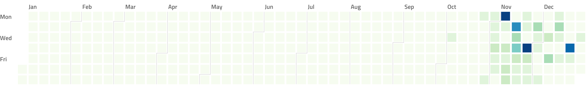

# 🌱 fescue 🌱

Calendar Heatmap Generation of the read articles on Feedly.

```bash
go run main.go -file token.json -date $(date '+%Y-%m-%d') -json data.json | ~/go/bin/calendarheatmap > chart.png
```



[NOTE] Please take a look at [sfanous/go-feedly](https://github.com/sfanous/go-feedly) for the format of token.json
